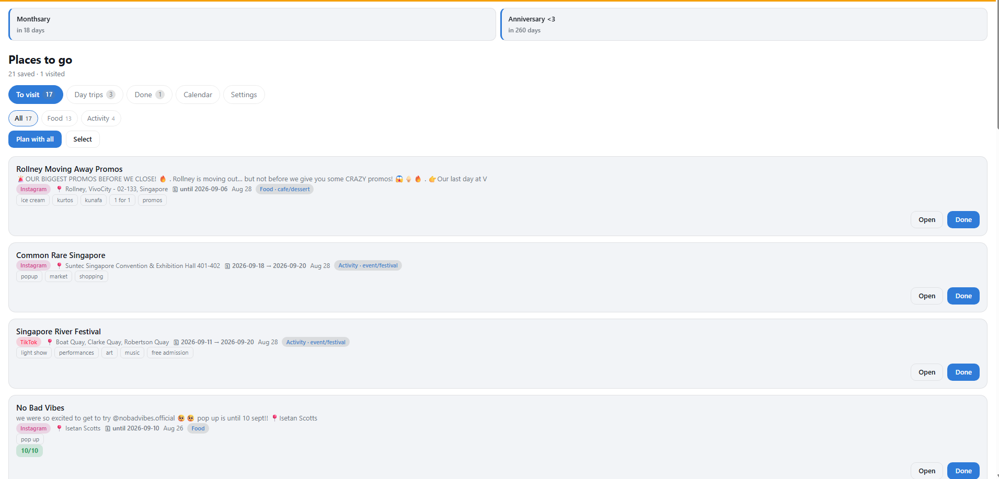
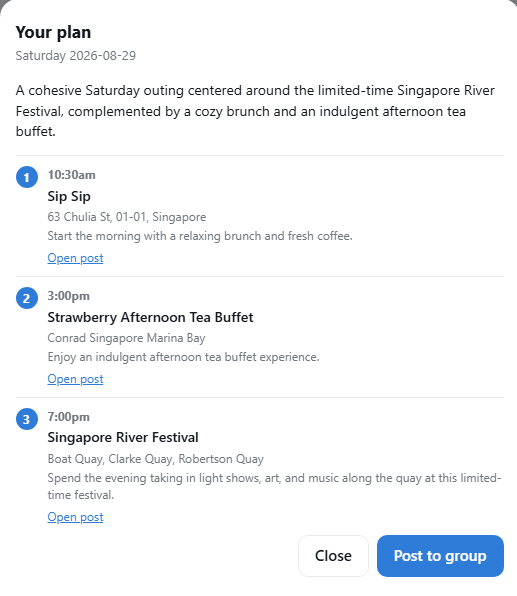

# Rawrffles Planner

A private Telegram bot and Mini App for two people to collect the food and event
posts they send each other, and turn them into actual plans.

Paste a TikTok or Instagram link into a shared group chat. The bot works out
what the place is, where it is, and what kind of thing it is, then files it into
a browsable list. When you want to go out, it builds a geographically coherent
itinerary from what you've saved.

Runs entirely on free tiers.



## Why

Links sent between two people disappear into chat history. This turns that
stream into a searchable, filterable list with ratings, notes, and a planner
that only ever suggests places you actually chose.

## Features

- **Automatic link intake** — paste a URL in the group; no commands or
  formatting required
- **Multi-source extraction** — yt-dlp, TikTok's oEmbed API, and vision-based
  reading of user screenshots for posts that can't be scraped
- **Structured parsing** — one LLM call per link produces title, location,
  region, event dates, category, subcategory, and tags
- **Geocoding** — locations resolved to coordinates via OneMap, with ambiguous
  results flagged rather than guessed
- **Mini App** — To visit / Day trips / Done / Calendar / Settings tabs,
  category and tag filters, ratings out of 10, and notes
- **Date planner** — clusters saved links by proximity, tiers them by urgency,
  and generates an itinerary; fills gaps with real nearby venues when saved
  links don't cover them
- **Anniversary, monthsary, and event countdowns** with per-date reminder
  schedules
- **Shared calendar** for day-to-day availability notes
- **In-app settings** — stops per plan, what counts as nearby, and the home
  region are editable in the Mini App rather than being constants in the source

### The planner

Stops are chosen in code and only arranged by the model. Every venue traces
back to a saved link or a real search result, and anything discovered nearby is
labelled as a suggestion rather than presented as something you'd already
picked.



## Architecture

```
Telegram group
      │
      ▼
Render (single FastAPI service)
   ├── bot webhook ──── intake, notifications
   ├── REST API ─────── initData HMAC auth + user allowlist
   └── Mini App ─────── static, same-origin
      │
      ▼
Neon Postgres
      ▲
      │
GitHub Actions ──► scheduled jobs, run independently of Render
```

Two front ends, one backend. GitHub Actions provides external cron because a
free-tier service that sleeps cannot fire its own schedules — the workflow talks
to Neon and the Telegram API directly, so a sleeping web service doesn't stop a
reminder going out. An uptime monitor pings `/health` to keep the service warm,
so replies arrive in seconds rather than after a cold start.

Scheduled: daily reminders, a daily pass to parse any captions still waiting,
and a weekly yt-dlp upgrade that retries links it previously couldn't read.
The weekly plan job exists but is deliberately not scheduled — plans are
triggered from the Mini App or with `/plan`.

Webhook deliveries are deduplicated on `update_id` with a single atomic
statement, so Telegram's retries can't double-process a message. A handler
failure releases the claim and returns 500 so the update is redelivered —
bounded at three attempts.

### Link processing pipeline

```
paste URL
   ↓
chat allowlist check          ← before any billable call
   ↓
URL detection → canonical resolution → dedup
   ↓
yt-dlp → TikTok oEmbed → user screenshot   (fallback chain)
   ↓
single Gemini call → structured JSON
   ↓
OneMap geocoding → lat/lng
   ↓
Postgres → REST API → Mini App
```

## Stack

| Layer | Choice |
|---|---|
| Language | Python 3.12 |
| Bot | python-telegram-bot |
| API | FastAPI + uvicorn |
| Frontend | Telegram Mini App (plain HTML/CSS/JS) |
| Database | Postgres (Neon) via psycopg; SQLite supported for local dev |
| LLM | Gemini via `google-genai` |
| Extraction | yt-dlp, TikTok oEmbed |
| Geocoding | OneMap (Singapore Land Authority) |
| Hosting | Render free tier |
| Scheduling | GitHub Actions (production), APScheduler (local) |

## Design principles

**Deterministic logic stays in code.** Clustering, urgency scoring, filtering,
and deduplication are computed, not prompted. The LLM handles only bounded
natural-language tasks: turning text or images into structured data, and
arranging a pre-filtered shortlist into prose.

**The model never originates a place name.** Every venue in a generated plan
traces back to a saved link or a real API result. Both structured output and
prose are validated against the candidate set.

**Failures are legible.** When something can't work, the system names which
thing, why, and what would fix it. Silent failure is treated as a bug.

**Humans get an override.** Anywhere automation makes a judgment call, there's
a documented way to overrule it, and anything the two users might reasonably
want changed is editable in the app rather than hardcoded.

## Setup

Requires Python 3.12+.

```bash
python -m venv venv
venv\Scripts\activate          # Windows; source venv/bin/activate elsewhere
pip install -r requirements.txt
copy .env.example .env.planner  # then fill it in
```

Then run whichever half you need:

```bash
python -m app.bot    # the bot, polling
python -m app.api    # REST API + Mini App on http://127.0.0.1:8000
```

The Mini App is served at `/miniapp/` and the API docs at `/docs`. Outside
Telegram there's no signed identity, so generate a development token with
`python -m scripts.make_init_data` and paste it into the banner the page shows.

Environment variables are documented in `.env.example`. `render.yaml` describes
the deployed service, and `.github/workflows/scheduled-jobs.yml` the scheduled
jobs; `CLAUDE.md` carries the operational notes, including the constraints that
shaped these choices.

Local development defaults to polling; production uses webhooks, selected via
`TELEGRAM_TRANSPORT`. Never run both against the same bot token.

## Limitations

**Photo posts can't be extracted.** TikTok slideshows and Instagram carousel
(`/p/`) posts expose no caption or metadata to any of the extraction paths.
These need a screenshot: send the informative slide to the group with the post
URL in the photo's caption, and the vision path reads it. Scraping the slide
images is deliberately not done — it's fragile and most slides are irrelevant.

**yt-dlp breaks when platforms change their internals.** It scrapes, so
extraction failures are periodic and often intermittent — the same URL can fail
and then succeed twenty minutes later. TikTok's oEmbed API is a published
endpoint and covers most of what breaks; the screenshot path covers the rest.
A weekly job upgrades yt-dlp and retries links it previously couldn't read.

**Events come only from saved links.** There is no free source of Singapore
event data. Eventbrite's public search endpoint was withdrawn, Ticketmaster's
coverage omits Singapore, and data.gov.sg publishes downloadable datasets
rather than a location query. OneMap's thematic layers fill gaps with real
nearby *venues*, so a plan can suggest a place that exists but never an event
that isn't already in the list.

**Cold starts.** Render's free tier sleeps after about fifteen minutes idle and
takes roughly a minute to wake. An uptime monitor keeps it warm most of the
time, but a deploy or a missed ping means the first message after it waits.

## Scope

This project only processes URLs its two users paste themselves. It does not
scrape platform feeds, hashtags, or search results, and does not automate any
platform account.

## Status

Personal project, built for two users. Not intended as a general-purpose
product, and not accepting contributions — but the architecture notes may be
useful to anyone building something similar on free infrastructure.
